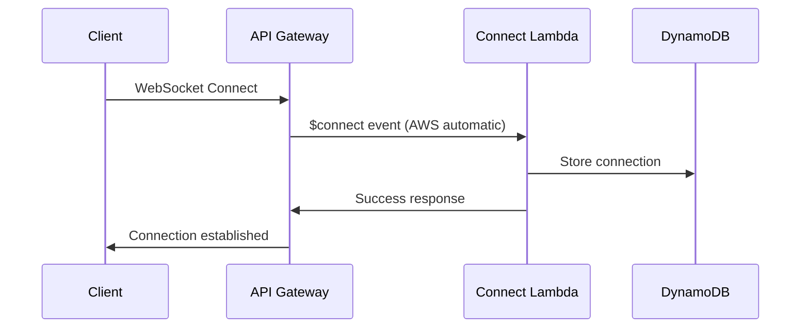
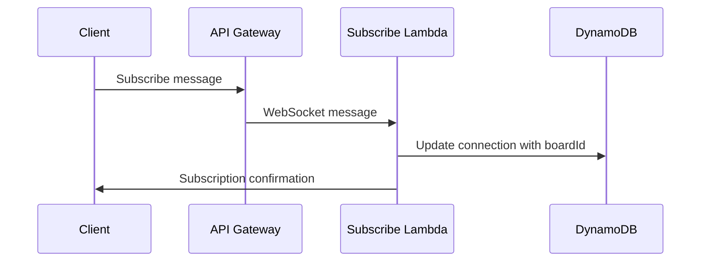
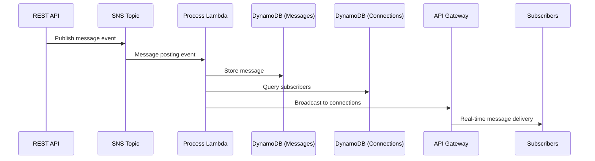
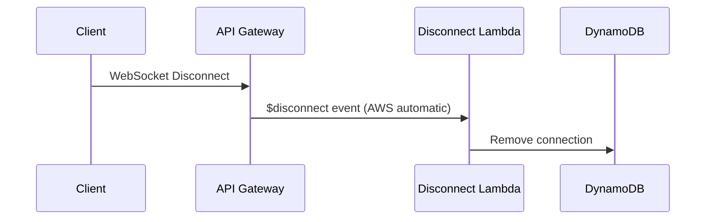

## Message Board

A simple async API where users can register, create boards, post messages to boards and request messages. It's implemented using serverless and event driven architecture with real-time subscription support via WebSockets.

## System Design

The Message Board is built using a **serverless, event-driven architecture** on AWS, providing scalability, reliability, and cost-effectiveness. The system supports both traditional REST API operations and real-time messaging through WebSockets.

### Architecture Overview

The system follows a **microservices pattern** with clear separation of concerns:

```
┌─────────────────┐    ┌─────────────────┐    ┌─────────────────┐
│                 │    │                 │    │                 │
│     Client      │    │   API Gateway   │    │   Lambda        │
│   Applications  │◄──►│   (REST + WS)   │◄──►│   Functions     │
│                 │    │                 │    │                 │
└─────────────────┘    └─────────────────┘    └─────────────────┘
                                │                        │
                                │                        ▼
                                │               ┌─────────────────┐
                                │               │   Event Bus     │
                                │               │   (SNS + SQS)   │
                                │               └─────────────────┘
                                │                        │
                                ▼                        ▼
                       ┌─────────────────┐    ┌─────────────────┐
                       │   DynamoDB      │    │   Processor     │
                       │   Tables        │◄───│   Functions     │
                       └─────────────────┘    └─────────────────┘
```

### Core Components

#### 1. **API Gateway**
- **REST API**: Handles HTTP requests for user registration, board operations, and message posting
- **WebSocket API**: Manages real-time connections for live message subscriptions
- **Features**: Rate limiting, CORS, request validation, automatic scaling

#### 2. **Lambda Functions**
The system is divided into distinct Lambda functions for different responsibilities:

**API Handlers** (Synchronous):
- `registerUser`: Accepts user registration requests
- `getUserByEmail`: Retrieves user information
- `listBoards`: Returns all available boards
- `createBoard`: Accepts board creation requests
- `postMessage`: Accepts message posting requests

**WebSocket Handlers** (Real-time):
- `websocketConnect`: Manages WebSocket connection establishment
- `websocketDisconnect`: Handles connection cleanup
- `websocketSubscribe`: Processes subscription/unsubscription requests

**Event Processors** (Asynchronous):
- `processUserRegistration`: Creates users in database
- `processBoardCreation`: Creates boards in database
- `processMessagePosting`: Creates messages and broadcasts to subscribers

#### 3. **Event-Driven Architecture**
The system uses AWS managed services for reliable event processing:

**SNS Topics**:
- `UserRegistrationTopic`: User creation events
- `MessagePostingTopic`: New message events

**SQS Queues**:
- `BoardCreationQueue`: Board creation events (with retry capabilities)

#### 4. **Data Storage**
**DynamoDB Tables** with optimized schemas:

**Users Table**:
```
Primary Key: id + createdAt
Global Secondary Index: email-index
Attributes: id, name, email, createdAt
```

**Boards Table**:
```
Primary Key: id + createdAt  
Attributes: id, name, createdBy, createdAt
```

**Messages Table**:
```
Primary Key: id + createdAt
Global Secondary Indexes:
  - boardId-index (for board message queries)
  - userId-index (for user message queries)
  - topic-index (for topic-based queries)
Attributes: id, topic, data, boardId, userId, createdAt
```

**WebSocket Connections Table**:
```
Primary Key: connectionId
Global Secondary Index: boardId-index (for broadcasting)
Attributes: connectionId, boardId, userId, connectedAt
```

### Design Principles

#### 1. **Asynchronous Processing**
- **API Responsiveness**: API endpoints return immediately (202 Accepted) while processing happens asynchronously
- **Decoupled Components**: Producers and consumers are independent
- **Fault Tolerance**: Failed events can be retried without affecting other operations

#### 2. **Event-Driven Communication**
- **Loose Coupling**: Components communicate through events, not direct calls
- **Scalability**: Each component can scale independently based on load
- **Reliability**: AWS managed services provide built-in retry and dead letter queue capabilities

#### 3. **Serverless Benefits**
- **Auto Scaling**: Functions scale automatically with demand
- **Cost Efficiency**: Pay only for actual usage
- **High Availability**: AWS manages infrastructure availability
- **No Server Management**: Focus on business logic, not infrastructure

#### 4. **Real-time Capabilities**
- **WebSocket Connections**: Persistent connections for instant message delivery
- **Selective Broadcasting**: Messages sent only to relevant subscribers
- **Connection Management**: Automatic cleanup of stale connections

### Data Flow Examples

#### User Registration Flow
```
1. POST /users/register → API Gateway
2. registerUser Lambda → Validates input
3. SNS Topic → Publishes user creation event  
4. processUserRegistration Lambda → Creates user in DynamoDB
5. Response: "202 Accepted" (immediate)
```

#### Real-time Message Flow
```
1. POST /boards/{id}/messages → API Gateway
2. postMessage Lambda → Validates input
3. SNS Topic → Publishes message event
4. processMessagePosting Lambda → 
   a. Creates message in DynamoDB
   b. Queries WebSocket connections for board subscribers
   c. Broadcasts message to all subscribers via WebSocket API
5. Response: "202 Accepted" + Real-time delivery to subscribers
```

### Scalability Characteristics

#### **Horizontal Scaling**
- **Lambda Concurrency**: Up to 1000 concurrent executions per region (configurable)
- **API Gateway**: Handles millions of requests per second
- **DynamoDB**: Auto-scales read/write capacity based on demand
- **WebSocket Connections**: Up to 100,000 concurrent connections per region

#### **Performance Optimization**
- **Database Indexes**: Optimized queries with GSIs
- **Event Batching**: Process multiple events in single Lambda invocation
- **Connection Pooling**: Reuse database connections across Lambda invocations
- **Memory Allocation**: Right-sized Lambda memory for optimal performance/cost

#### **Cost Optimization**
- **Pay-per-use**: No idle resource costs
- **DynamoDB On-Demand**: Automatic scaling without over-provisioning
- **Lambda Provisioned Concurrency**: Only when needed for consistent performance
- **CloudWatch Monitoring**: Track and optimize costs continuously

### Security Model

#### **Network Security**
- **HTTPS/WSS**: All communication encrypted in transit
- **VPC**: Lambda functions can be deployed in private VPC if needed
- **API Gateway**: Built-in DDoS protection

#### **Data Protection**
- **DynamoDB Encryption**: Data encrypted at rest
- **IAM Roles**: Least privilege access for all components
- **Input Validation**: All inputs validated using Zod schemas

#### **Future Security Enhancements**
- **Authentication**: JWT-based user authentication
- **Authorization**: Role-based access control
- **Rate Limiting**: Per-user request throttling

## Subscription System Design

The Message Board includes a real-time subscription system that allows users to receive instant notifications when new messages are posted to boards they're interested in. This system is built using AWS WebSocket API Gateway and DynamoDB for connection management.

### Overview

The subscription system enables real-time messaging through WebSocket connections, allowing users to:
- Subscribe to specific message boards
- Receive real-time notifications when new messages are posted
- Manage multiple subscriptions simultaneously
- Automatically handle connection cleanup

### Architecture Components

```
┌─────────────────┐    ┌─────────────────┐    ┌─────────────────┐
│   WebSocket     │    │   REST API      │    │   Message       │
│   Client        │◄──►│   Gateway       │◄──►│   Processing    │
└─────────────────┘    └─────────────────┘    └─────────────────┘
         │                        │                        │
         │                        │                        │
         ▼                        ▼                        ▼
┌─────────────────┐    ┌─────────────────┐    ┌─────────────────┐
│   WebSocket     │    │   HTTP Lambda   │    │   SNS Topic     │
│   Lambda        │    │   Functions     │    │   (Messages)    │
└─────────────────┘    └─────────────────┘    └─────────────────┘
         │                                              │
         │              ┌─────────────────┐            │
         └──────────────►│   DynamoDB      │◄───────────┘
                        │   (Connections) │
                        └─────────────────┘
                                 │
                        ┌─────────────────┐
                        │   Broadcast     │
                        │   Lambda        │
                        └─────────────────┘
```

### Database Design

#### WebSocket Connections Table

The WebSocket connections are managed in a dedicated DynamoDB table:

**Table Name**: `websocket-connections-table-{stage}`

**Schema**:
```typescript
{
  connectionId: string (Primary Key)    // Unique WebSocket connection identifier
  boardId?: string (GSI)               // Board the connection is subscribed to
  userId?: string                      // Optional user identifier
  connectedAt: string                  // ISO timestamp when connection was established
}
```

**Indexes**:
- **Primary Key**: `connectionId` - Direct connection lookup
- **GSI**: `boardId-index` - Query all connections subscribed to a specific board

**Example Records**:
```json
[
  {
    "connectionId": "conn_abc123",
    "boardId": "board_456",
    "userId": "user_789",
    "connectedAt": "2023-12-01T15:30:00.000Z"
  },
  {
    "connectionId": "conn_def456",
    "boardId": "board_456",
    "userId": "user_101",
    "connectedAt": "2023-12-01T15:31:00.000Z"
  }
]
```

### Workflow

#### 1. Connection Establishment (Infrastructure Level)



**Process**:
1. Client initiates WebSocket connection to API Gateway
2. **AWS automatically** triggers `websocketConnect` Lambda function via `$connect` route
3. Lambda stores connection ID in DynamoDB (without board subscription initially)
4. Connection is established and ready for subscription requests

**Why This Step Exists**:
- `$connect` is a **required AWS API Gateway WebSocket route** - not optional
- Provides **infrastructure-level connection tracking** for monitoring and cleanup
- Enables **multi-subscription support** (one connection, many board subscriptions)
- **Automatic cleanup** when network connections drop unexpectedly

#### 2. Board Subscription



**Process**:
1. Client sends subscription message: `{"action": "subscribe", "boardId": "board_123", "userId": "user_456"}`
2. API Gateway routes message to `websocketSubscribe` Lambda function
3. Lambda validates message format using Zod schema
4. Lambda updates DynamoDB record with `boardId` to establish subscription
5. Lambda sends confirmation back to client

**Message Format**:
```typescript
{
  action: "subscribe",
  boardId: string,      // Required: Board to subscribe to
  userId?: string       // Optional: User making subscription
}
```

#### 3. Message Broadcasting



**Process**:
1. Message is posted via REST API (`POST /boards/{boardId}/messages`)
2. REST API publishes event to SNS topic
3. `processMessagePosting` Lambda function processes the event
4. Lambda stores message in DynamoDB messages table
5. Lambda queries connections table for all subscriptions to the board
6. Lambda broadcasts message to all connected subscribers via API Gateway WebSocket API
7. Subscribers receive real-time message notification

**Broadcast Message Format**:
```typescript
{
  type: "message",
  boardId: string,
  message: {
    id: string,
    topic: string,
    data: string,
    boardId: string,
    userId: string,
    createdAt: string
  }
}
```

#### 4. Connection Cleanup (Infrastructure Level)



**Process**:
1. Client disconnects (intentionally or due to network issues)
2. **AWS automatically** triggers `websocketDisconnect` Lambda function via `$disconnect` route
3. Lambda removes connection record from DynamoDB
4. All board subscriptions for this connection are automatically cleaned up

**Why This Step Exists**:
- `$disconnect` is a **required AWS API Gateway WebSocket route** - not optional
- Provides **immediate cleanup** when connections close (vs. waiting for broadcast failures)
- **Prevents database bloat** from stale connection records
- **Accurate connection metrics** for monitoring and capacity planning

### Error Handling and Resilience

#### Stale Connection Management

The system automatically handles stale connections:

```typescript
// In websocketService.broadcastToBoard()
try {
  await client.send(new PostToConnectionCommand({
    ConnectionId: connection.connectionId,
    Data: JSON.stringify(message)
  }));
} catch (error) {
  // If connection is stale (410 error), remove it
  if (error?.statusCode === 410) {
    console.info(`Removing stale connection ${connection.connectionId}`);
    await removeConnection(connection.connectionId);
  }
}
```

#### Fault Tolerance

- **Message Processing**: Uses `Promise.allSettled()` to ensure all subscribers receive messages even if some fail
- **Connection Failures**: Failed connections are logged but don't prevent other subscribers from receiving messages
- **Data Consistency**: Connection state is eventually consistent through DynamoDB
- **Retry Logic**: AWS services provide built-in retry mechanisms for transient failures

### Scalability Characteristics

#### DynamoDB Scaling
- **On-Demand Billing**: Automatically scales read/write capacity
- **Global Secondary Index**: Efficient querying by `boardId` for broadcast operations
- **Eventually Consistent**: Optimized for high-throughput scenarios

#### Lambda Concurrency
- **WebSocket Handlers**: Scale automatically with connection volume
- **Broadcast Processing**: Parallel execution for multiple board subscriptions
- **Memory Optimization**: Functions use appropriate memory allocation for their workload

#### Connection Limits
- **API Gateway**: Supports up to 100,000 concurrent connections per region
- **Lambda Duration**: WebSocket functions have 15-minute maximum execution time
- **Broadcast Fan-out**: Efficient parallel broadcasting to multiple connections

### Monitoring and Observability

#### Key Metrics
- **Active Connections**: Number of concurrent WebSocket connections
- **Subscription Rate**: New subscriptions per minute
- **Message Broadcast Rate**: Messages broadcasted per minute
- **Connection Cleanup Rate**: Stale connections removed per minute

#### Logging
- **Connection Events**: All connect/disconnect/subscribe events are logged
- **Broadcast Results**: Success/failure of message broadcasts to individual connections
- **Error Tracking**: Failed broadcasts and connection errors are tracked

### Security Considerations

#### Connection Authentication
- Currently no authentication required (development mode)
- Production should implement JWT-based authentication
- Connection metadata can include user identification

#### Data Validation
- All WebSocket messages validated using Zod schemas
- Input sanitization prevents injection attacks
- Connection state isolated per connection

#### Network Security
- HTTPS/WSS in production environments
- API Gateway provides DDoS protection
- Lambda functions run in isolated execution environments

### Development and Testing

#### Local Development
```bash
# Start WebSocket API locally
npm run offline

# WebSocket URL: ws://localhost:3001
```

#### Testing WebSocket Connections
```bash
# Install wscat for testing
npm install -g wscat

# Connect to local WebSocket
wscat -c ws://localhost:3001

# Send subscription message
{"action": "subscribe", "boardId": "test-board", "userId": "test-user"}

# Send unsubscription message
{"action": "unsubscribe", "boardId": "test-board"}
```

### Frequently Asked Questions

#### Q: Why do we need separate connection/disconnection handlers? Can't users just subscribe/unsubscribe?

**A**: Great question! From a **user perspective**, you're absolutely right - they only care about subscribing and unsubscribing from boards. However, we need separate connection handlers because:

1. **AWS Requirement**: `$connect` and `$disconnect` are **required AWS API Gateway WebSocket routes**. AWS automatically triggers these when WebSocket connections are established/closed - they're not optional.

2. **Infrastructure vs. Application**: 
   - **Connection management** = Infrastructure level (network connectivity)
   - **Subscription management** = Application level (business logic)

3. **Multi-subscription Support**: One WebSocket connection can subscribe to multiple boards. The connection is the "transport layer" while subscriptions are the "application layer".

4. **Automatic Cleanup**: When a user closes their browser or loses network connection, AWS automatically triggers `$disconnect`, ensuring immediate database cleanup without waiting for broadcast failures.

**Think of it like a phone system**:
- **Connection** = Picking up the phone (dial tone)
- **Subscription** = Dialing specific numbers (choosing what to listen to)

You need both layers for a robust system, even though users only interact with the subscription layer.

#### Q: Could we simplify this to only handle subscriptions?

**A**: While tempting, this would create problems:

- **AWS Compliance**: We'd still need empty `$connect`/`$disconnect` handlers to satisfy AWS requirements
- **Resource Leaks**: No automatic cleanup of stale connections
- **Monitoring Blind Spots**: No visibility into connection health vs. subscription health
- **Debugging Difficulty**: Harder to distinguish network issues from application logic issues

The current design follows AWS best practices and separates concerns cleanly between infrastructure and application layers.

The subscription system provides a robust, scalable foundation for real-time messaging while maintaining the event-driven architecture principles of the overall Message Board application.

## Usage

### Deployment

Install dependencies with:

```
npm install
```

and then deploy with:

```
npm run deploy
```

After running deploy, you should see output similar to:

```
❯ sls deploy --stage dev

Deploying "message-board" to stage "dev" (ap-southeast-2)

✔ Service deployed to stack message-board-dev (54s)

endpoints:
  POST - https://bz89bd7xv5.execute-api.ap-southeast-2.amazonaws.com/users/register
  GET - https://bz89bd7xv5.execute-api.ap-southeast-2.amazonaws.com/users/{email}
  GET - https://bz89bd7xv5.execute-api.ap-southeast-2.amazonaws.com/boards
  POST - https://bz89bd7xv5.execute-api.ap-southeast-2.amazonaws.com/boards
  POST - https://bz89bd7xv5.execute-api.ap-southeast-2.amazonaws.com/boards/{boardId}/messages
functions:
  registerUser: message-board-dev-registerUser (394 kB)
  getUserByEmail: message-board-dev-getUserByEmail (394 kB)
  listBoards: message-board-dev-listBoards (394 kB)
  createBoard: message-board-dev-createBoard (394 kB)
  postMessage: message-board-dev-postMessage (394 kB)
  processUserRegistration: message-board-dev-processUserRegistration (394 kB)
  processBoardCreation: message-board-dev-processBoardCreation (394 kB)
  processMessagePosting: message-board-dev-processMessagePosting (394 kB)
```

### Invocation

After successful deployment, you can create a new user by calling the corresponding endpoint:

```sh
❯ curl -X POST --header 'Content-Type: application/json' -d '{"email": "test1@test.com", "name": "Test 1"}' https://bz89bd7xv5.execute-api.ap-southeast-2.amazonaws.com/users/register
{"message":"User registration request is accepted."}%  
```

### Local development

The easiest way to develop and test your function is to use the `dev` command:

```sh
npm run dev
```

This will start a local emulator of AWS Lambda and tunnel your requests to and from AWS Lambda, allowing you to interact with your function as if it were running in the cloud.

Now you can invoke the function as before, but this time the function will be executed locally. Now you can develop your function locally, invoke it, and see the results immediately without having to re-deploy.

When you are done developing, don't forget to run `serverless deploy` to deploy the function to the cloud.

## Testing

### Unit Testing

It is possible and should cover the coverage threshold, update source code to be more testable if required.

We should integrate automatic testing into CI/CD pipeline.

```sh
❯ npm run test

> message-board@1.0.0 test
> vitest run


 RUN  v3.2.4 /Users/ling/projects/playground/message-board

....

 ✓ test/handlers/user.test.ts (10 tests) 6ms

 Test Files  2 passed (2)
      Tests  13 passed (13)
   Start at  08:06:01
   Duration  388ms (transform 62ms, setup 0ms, collect 246ms, tests 10ms, environment 0ms, prepare 111ms)
```

### Integration Testing (automatic)

It is a bit difficult as it involves AWS resources, but I might be wrong.

### Manual Testing

Run the application locally or deploy to dev for end-to-end testing.

Local testing:

```sh
npm run offline
npm run dev
```

Dev testing:

```sh
npm run deploy --stage dev
```
