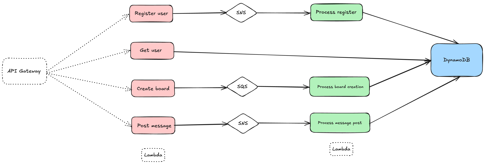

## Message Board

A simple async API where ues can register, create boards, post messages to boards and request messages. It's implemented using serverless and event driven architecture.

## System Design



## Usage

### Deployment

Install dependencies with:

```
npm install
```

and then deploy with:

```
npm run deploy
```

After running deploy, you should see output similar to:

```
❯ sls deploy --stage dev

Deploying "message-board" to stage "dev" (ap-southeast-2)

✔ Service deployed to stack message-board-dev (54s)

endpoints:
  POST - https://bz89bd7xv5.execute-api.ap-southeast-2.amazonaws.com/users/register
  GET - https://bz89bd7xv5.execute-api.ap-southeast-2.amazonaws.com/users/{email}
  GET - https://bz89bd7xv5.execute-api.ap-southeast-2.amazonaws.com/boards
  POST - https://bz89bd7xv5.execute-api.ap-southeast-2.amazonaws.com/boards
  POST - https://bz89bd7xv5.execute-api.ap-southeast-2.amazonaws.com/boards/{boardId}/messages
functions:
  registerUser: message-board-dev-registerUser (394 kB)
  getUserByEmail: message-board-dev-getUserByEmail (394 kB)
  listBoards: message-board-dev-listBoards (394 kB)
  createBoard: message-board-dev-createBoard (394 kB)
  postMessage: message-board-dev-postMessage (394 kB)
  processUserRegistration: message-board-dev-processUserRegistration (394 kB)
  processBoardCreation: message-board-dev-processBoardCreation (394 kB)
  processMessagePosting: message-board-dev-processMessagePosting (394 kB)
```

### Invocation

After successful deployment, you can create a new user by calling the corresponding endpoint:

```sh
❯ curl -X POST --header 'Content-Type: application/json' -d '{"email": "test1@test.com", "name": "Test 1"}' https://bz89bd7xv5.execute-api.ap-southeast-2.amazonaws.com/users/register
{"message":"User registration request is accepted."}%  
```

### Local development

The easiest way to develop and test your function is to use the `dev` command:

```sh
npm run dev
```

This will start a local emulator of AWS Lambda and tunnel your requests to and from AWS Lambda, allowing you to interact with your function as if it were running in the cloud.

Now you can invoke the function as before, but this time the function will be executed locally. Now you can develop your function locally, invoke it, and see the results immediately without having to re-deploy.

When you are done developing, don't forget to run `serverless deploy` to deploy the function to the cloud.

## Testing

### Unit Testing

It is possible and should cover the coverage threshold, update source code to be more testable if required.

We should integrate automatic testing into CI/CD pipeline.

```sh
❯ npm run test

> message-board@1.0.0 test
> vitest run


 RUN  v3.2.4 /Users/ling/projects/playground/message-board

....

 ✓ test/handlers/user.test.ts (10 tests) 6ms

 Test Files  2 passed (2)
      Tests  13 passed (13)
   Start at  08:06:01
   Duration  388ms (transform 62ms, setup 0ms, collect 246ms, tests 10ms, environment 0ms, prepare 111ms)
```

### Integration Testing (automatic)

It is a bit difficult as it involves AWS resources, but I might be wrong.

### Manual Testing

Run the application locally or deploy to dev for end-to-end testing.

Local testing:

```sh
npm run offline
npm run dev
```

Dev testing:

```sh
npm run deploy --stage dev
```
