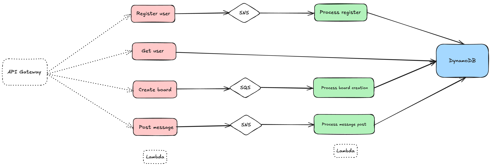

## Functionalities

### Functional

- Register user: async with SNS
- Get user by email: sync
- Create a message board: async with SQS
- Post a message: async with SNS
- *User subscribe to messages: realtime via appsync or websocket

### Non functional

- Rate limit: API Gateway

- Extensibility
- Scalability: lambda & dynamodb
- Availability

- Testing
- Logging
- Error handling
- Monitoring

- User experience

### Out of scope

- Authorization

## System Components

## Database Design

**User table**:
- ID (PK)
- name
- email (GSI, partition)
- createdAt

**Board table**:
- ID (PK)
- name
- createdBy
- createdAt

**Message table**:
- ID (PK)
- topic (GSI, pk)
- data
- boardId (GSI, pk)
- userId (GSI, pk)
- createdAt (GSI, SK)

## Deployment

- CI/CD: github actions
- Infrastructure as code: Serverless Framework
- Cloud provider: AWS